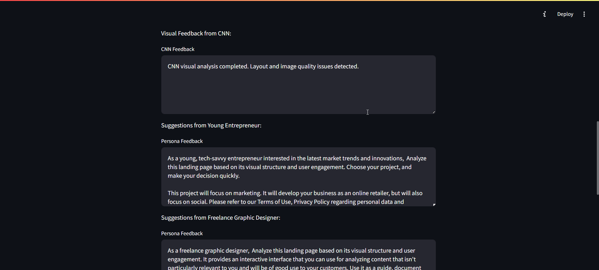

  

# Landing Page Analyzer

A comprehensive tool for evaluating landing pages through both visual and AI-powered analysis. This project independently combines computer vision and language models to provide actionable, multi-perspective feedback for web designers and marketers.

---

## 🚀 Features

- **Visual Analysis**: Utilizes a pre-trained ResNet50 model to assess design elements, layout consistency, and visual appeal.
- **AI-Powered Feedback**: Integrates OpenAI's GPT-4 to generate persona-based suggestions for improving content clarity and call-to-action effectiveness.
- **Automated Screenshot Capture**: Employs Selenium to capture and process screenshots of web pages, bypassing bot protection mechanisms.
- **Modular Architecture**: Structured with distinct modules (`image_analysis.py`, `openai_functions.py`, `prompt_template.py`, etc.) for maintainability and scalability.
- **Deployment**: Deployed on Render for easy accessibility and real-time analysis.

---

## 🛠️ Tech Stack

  
  
  
  
  

---

## 📝 Installation

Clone the Repository
Begin by cloning the repository and navigating into the project directory:

git clone https://github.com/2005-PriyanshuSaini/Landing-Page-Analyser.git
cd Landing-Page-Analyser

Create and Activate a Virtual Environment
Set up a virtual environment to manage project dependencies.

For Windows:
python -m venv env
env\Scripts\activate

For macOS/Linux:
python3 -m venv env
source env/bin/activate

Install Required Dependencies
Install the necessary Python packages using the requirements.txt file:

pip install -r requirements.txt

Run the Streamlit Application
Launch the Streamlit app with the following command:

streamlit run app.py

Upon successful execution, you should see output similar to:

You can now view your Streamlit app in your browser.
Local URL: http://localhost:8501
Note: If the application doesn't open automatically in your browser, manually navigate to the provided Local URL (for example, http://localhost:8501).

🛠 Troubleshooting Tips

Port Already in Use: If port 8501 is occupied, specify an alternative port:
streamlit run app.py --server.port 8502

Firewall or Antivirus Restrictions: Ensure that your firewall or antivirus software isn't blocking Streamlit.

Streamlit Not Recognized: If you encounter a "command not found" error for streamlit, ensure that your virtual environment is activated and Streamlit is installed.

Blank Page in Browser: If the browser displays a blank page, try clearing the browser cache or using a different browser.

---

## 💡 Usage

streamlit run app.py

- Choose to capture a screenshot from a URL or upload an image.
- Click **Analyze Image** to receive detailed feedback.

---

## 📂 Project Structure

- `app.py` - Main Streamlit application.
- `web_screenshot.py` - Captures webpage screenshots.
- `image_analysis.py` - Handles image analysis with Hugging Face.
- `openai_functions.py` - Manages OpenAI API calls.
- `ai_personas.py` - Persona prompt definitions.
- `prompt_template.py` - Templates for AI interactions.

---

## 📸 Screenshots

press enter after putting the url for the landing page

click on analyze image after you see the image on screen

cnn and gpt results

---

## 🔮 Future Plans

- Add more AI personas for broader feedback. (Completed)
To enable more diverse AI feedback, change the import statement in your code:
Replace
from ai_personas import persona_prompts_small as persona_prompts
with
from ai_personas import persona_prompts_large as persona_prompts

- Batch analysis for multiple pages.
Implement functionality to analyze several landing pages at once, allowing users to upload or input a list of URLs for simultaneous evaluation.

- Exportable analysis reports.
Add options to export analysis results in various formats (such as PDF, CSV, or Excel) so users can easily share or archive their reports.

- A/B testing insights.
Integrate features that provide insights and comparisons between different landing page versions (A/B testing), helping users identify which version performs better based on the analysis.

---

## 👤 Author

Built independently by Priyanshu Saini.

---
